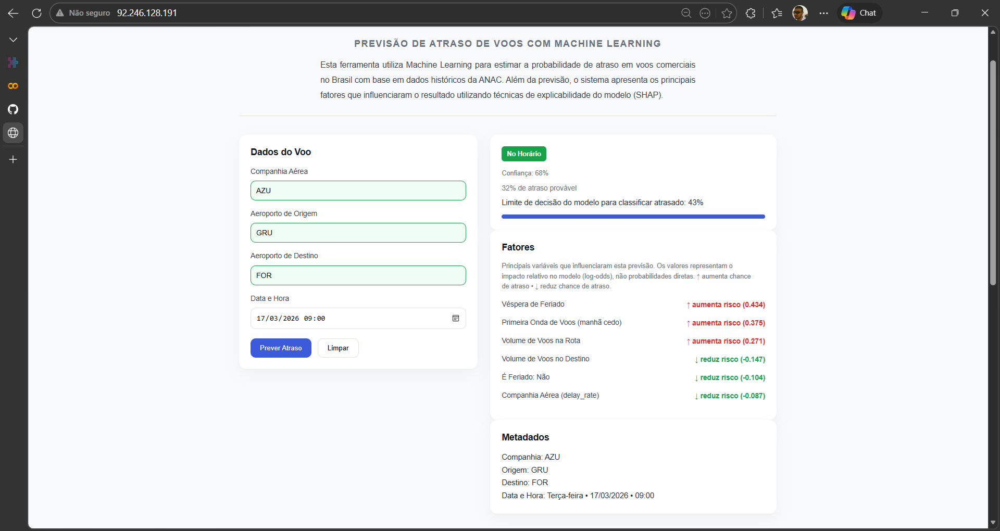
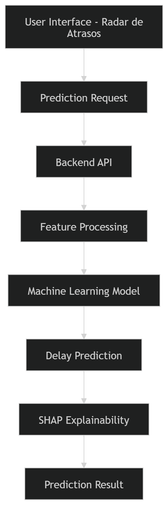

# Radar de Atrasos ✈️
Predicting Flight Delays in Brazil using Machine Learning and ANAC aviation data.

<p align="center">
  
</p>

This project analyzes Brazilian flight operational data to identify patterns associated with delays and build predictive models capable of estimating the probability of a flight departing late.


# Project Overview

Flight delays are a major operational challenge for airlines and airports. Late departures impact passengers, increase operational costs, and disrupt airport logistics.

This project uses historical flight data from the Brazilian Civil Aviation Agency (ANAC) to build machine learning models capable of predicting whether a flight will depart late.

The final system includes:

- Data analysis and feature engineering
- Machine learning classification models
- Delay prediction interface
- Model explainability using SHAP

# Architecture Overview

The system architecture integrates the prediction interface, backend services and the machine learning model responsible for estimating flight delays.

<p align="center">
  
</p>

# Live Prediction Interface

The project includes a prediction interface that allows users to simulate flight conditions and obtain delay predictions.

Inputs include:

- Airline
- Origin airport
- Destination airport
- Flight time

The system returns:

- Delay probability
- Predicted status (delayed or on-time)
- Main factors influencing the prediction


# Machine Learning Pipeline

The modeling process follows a structured workflow:

1. Data collection from ANAC public datasets
2. Data cleaning and validation
3. Feature engineering
4. Leakage prevention
5. Feature selection (Correlation + VIF)
6. Model training
7. Model evaluation
8. Model explainability using SHAP


# Model Card

Model Type  
Binary classification model predicting whether a flight will depart late.

Target Definition  
A flight is considered delayed if departure delay > 15 minutes.

Models Tested

- Logistic Regression
- Random Forest
- XGBoost

Selected Model

XGBoost was selected as the primary model due to its performance and ability to capture nonlinear relationships.

Evaluation Metrics

The models were evaluated using:

- Accuracy
- Precision
- Recall
- Confusion Matrix

Explainability

SHAP (SHapley Additive Explanations) was used to interpret model predictions and identify the most influential features.


# Data Dictionary

Main variables used in the project:

| Feature | Description |
|--------|-------------|
| airline | Airline operating the flight |
| origin | Departure airport |
| destination | Arrival airport |
| flight_hour | Hour of the flight |
| previous_delay | Delay history for that route |
| airport_traffic | Estimated airport traffic level |
| route_volume | Volume of flights on the route |

Target variable:

| Variable | Description |
|---------|-------------|
| delayed | Binary variable indicating whether the flight departed late |


# Pipeline Diagram

Data Collection (ANAC)
↓
Data Cleaning
↓
Feature Engineering
↓
Feature Selection
↓
Model Training (Logistic Regression / Random Forest / XGBoost)
↓
Model Evaluation
↓
SHAP Explainability
↓
Prediction Interface


# Technologies Used

- Python
- Pandas
- Scikit-Learn
- XGBoost
- Matplotlib
- SHAP
- Jupyter Notebook

# Project Structure

```
anac-flight-delay-predictor/

backend/
  model/
  services/

data_science/
  artifacts/
  data/
    raw/
    processed/
    sampled/
  model/
  notebooks/
  src/

frontend/
  assets/

requirements.txt
README.md
```

backend/
API logic and services responsible for running predictions.

data_science/
Data analysis, feature engineering, model training and experimentation.

frontend/
User interface used to simulate flight conditions and visualize predictions.

artifacts/
Saved objects such as trained models or intermediate outputs.

data/
Datasets used in the project.

notebooks/
Exploratory analysis and modeling notebooks.

src/
Core scripts used for data processing and model training.

# How to Run

Clone the repository

git clone https://github.com/JessePMelo/anac-flight-delay-prediction.git

Install dependencies

pip install -r requirements.txt

Then open the notebook to explore the analysis or run the prediction interface.


# Author

Jessé Pereira de Melo
